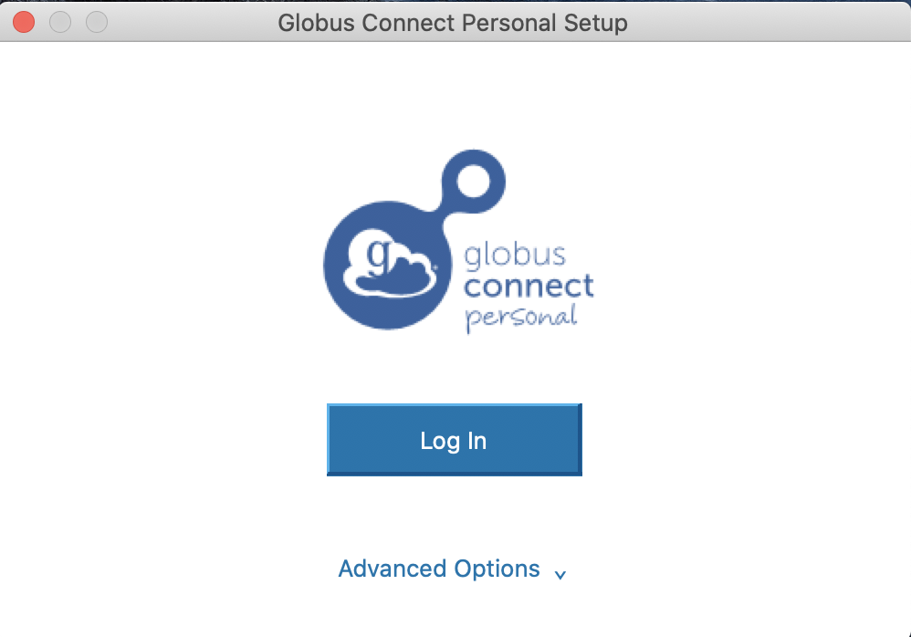
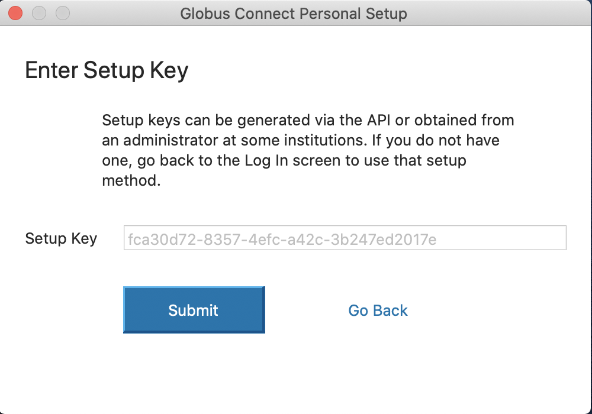

***************************
Downloading Data via Globus
***************************

All training and test data are maintained on the UofSC High Performance Computing Cluster, and can be accessed using the Globus interface. Follow the directions below to download data to your local machine/server.

Linux
=====

Globus is simplest to access via Linux, and a transfer can be completed without any user intervention. The only caveat is possible permission errors when attempting to transfer data to a server that requires a duo push. To transfer all available data to your current directory, simply run the following code:

.. code-block:: python

    import diffimageml
    diffimageml.fetchGlobus()

And that's it. See documentation for other options such as a different download directory. To download a specific folder:

.. code-block:: python

    import diffimageml
    diffimageml.fetchGlobus(globus_folders=['lco'])

Or a specific file:

.. code-block:: python

    import diffimageml
    diffimageml.fetchGlobus(globus_files=['README.txt'])

Mac or Windows
==============

Things are one step more complicated for Mac/Windows, since there is no Globus downloadable source for these platforms, but they should only have to happen once. Once you go through the steps below, you'll only need to open Globus Connect Personal in the future and run the python code at the bottom of this page to download new data. 

You'll need to install Globus Connect Personal yourself following the directions `here for Mac <https://docs.globus.org/how-to/globus-connect-personal-mac/>`_ or `here for Windows <https://docs.globus.org/how-to/globus-connect-personal-windows/>`_. Once you go through the istallation process on either platform, DO NOT LOGIN. When you open Globus Connect Personal after installing, you should see a window that looks like this:

Click on the "Advanced Options" button, so that you see something like this:

.. image:: _static/globus_advanced.png
    :width: 600px
    :align: center
    :height: 600px
    :alt: alternate text

Click on "I have a setup key", and leave the window open looking like this:

Now you can run the same code that worked for Linux (with the same options above and in the documentation):

.. code-block:: python

    import diffimageml
    diffimageml.fetchGlobus()

The code will identify that you are on a Mac/Windows machine, and print a Setup Key that it asks you to paste into your Globus Connect Personal window. Paste this into the Setup Key window visible in the final screenshot above, and hit Submit. A few seconds later it should tell you that the setup was complete, and you should then hit the exit button that appears. The code will recognize that this step was completed (it will wait up to 5 minutes for you to complete this step), and then proceed with the download. 

*************************
Uploading Data via Globus
*************************

Follow the same directions as for downloading from Globus, except please use the following function instead (see documentation for details)

.. code-block:: python

    import diffimageml
    diffimageml.uploadToGlobus(upload_files=['my_file_to_upload.txt'])